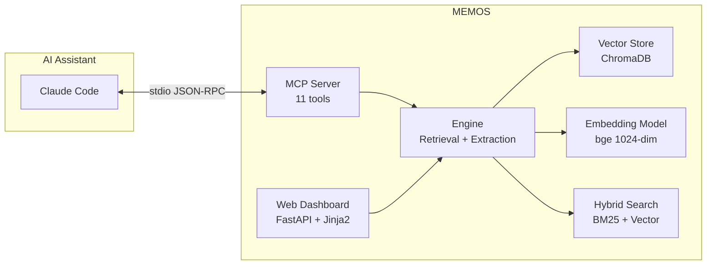

# MEMOS — Active Memory System for AI Coding Assistants

[](https://www.python.org)
[](LICENSE)
[](https://pypi.org/project/memomate/)

> 📖 [中文文档](README.zh.md)

**MEMOS** is a lightweight RAG engine designed for AI coding assistants. It provides **cross-session memory** — remembering technical decisions, bug fixes, user preferences, and code conventions from past conversations. Built on ChromaDB + bge-large-zh-v1.5 with a built-in MCP server.

## Features

- **🧠 Cross-Session Memory** — Captures knowledge from conversations, retrieves it across sessions
- **🔌 MCP Server** — 11 tools for AI assistant integration (Claude Code, etc.)
- **🔍 Hybrid Search** — Vector similarity (1024-dim) × BM25 keyword scoring, time-decay ranking
- **📊 Web Dashboard** — Browse, search, manage memories; visual configuration editor
- **🏗️ 4 Pipelines** — AI-suggested + direct-write + auto-harvest + manual curation
- **🗂️ Multi-Project** — Scoped by working directory, contexts stay separate
- **⚡ Lightweight** — Local-only, single process, no external services

## Quick Start

```bash
pip install memomate
memos init --force
memos dashboard
```

Open http://127.0.0.1:8000

> **Windows**: If model download stalls, set `$env:HF_ENDPOINT = "https://hf-mirror.com"` before `memos init`.

### Claude Code Integration

```bash
memos hook install
```

This registers MEMOS as an MCP server. Claude Code will automatically read and write memories during conversations.

## Why MEMOS?

Existing memory solutions for AI coding assistants typically:

- ❌ Store flat text without semantic search
- ❌ Require external services (PostgreSQL, Redis, cloud APIs)
- ❌ Lack cross-project isolation
- ❌ Don't handle time-based memory decay

MEMOS addresses these with a self-contained, local-first architecture designed specifically for the AI-assisted coding workflow.

## Architecture



### Project Structure

```
memos/
├── src/memos/
│   ├── config/      Pydantic models, loading chain, prompts
│   ├── storage/     Vector store abstraction (ChromaDB)
│   ├── engine/      Core: memory CRUD, extraction, review, BM25
│   ├── server/      MCP server (11 tools, FastMCP stdio)
│   ├── web/         FastAPI + Jinja2 dashboard
│   ├── cli/         argparse CLI (15+ commands)
│   ├── features/    Backup, daily review, notifications, wizard
│   └── hooks/       Claude Code hook scripts (prompt/stop)
├── memdb/           ChromaDB persistent data
├── model/           Local embedding models (~1.3GB)
└── etc/             Configuration files + i18n locales
```

## MCP Tools (for AI Assistants)

| Tool | Pipeline | Description |
|------|----------|-------------|
| `remember(text, metadata)` | A | Buffer → LLM extraction |
| `save_knowledge(text, type)` | B | Direct write to store |
| `recall(query, top_k, ...)` | — | Semantic + hybrid search |
| `list_memories(type, limit)` | — | Paginate project memories |
| `list_todos(status, limit)` | — | List pending action items |
| `update_todo(id, status)` | — | Change todo status |
| `delete_memory(memory_id)` | — | Delete by ID |
| `update_memory(id, text, meta)` | — | Update content/metadata |
| `force_extract()` | A | Trigger immediate extraction |
| `set_project_id(pid)` | — | Switch project scope |
| `log_complete_turn(user, asst)` | A | Log a conversation round |

## CLI Commands

| Command | Description |
|---------|-------------|
| `init` | First-time setup wizard |
| `dashboard` | Launch web UI |
| `server` | Start MCP server (stdio) |
| `status` | View system health |
| `doctor` | Diagnose and troubleshoot |
| `config show / set / validate` | Manage configuration |
| `export` | Export memories to JSONL |
| `import` | Import from JSONL |
| `backup / restore` | Full database backup |
| `hook install / uninstall / status` | Claude Code hook management |
| `auth regen` | Regenerate dashboard token |
| `vacuum` | Reclaim deleted document space |
| `reindex` | Rebuild BM25 index |

## Configuration

All settings in `etc/config.json`. Key sections:

```json
{
  "llm": {
    "endpoints": [
      {"name": "default", "api_base": "http://localhost:11434/v1"}
    ],
    "active": "default"
  },
  "model": {"name": "bge-large-zh-v1.5", "vector_dim": 1024},
  "memory": {"decay_lambda": 0.02, "default_top_k": 5},
  "suggestion": {"active_suggestion_threshold": 0.65}
}
```

Override any field via `MEMOS_{SECTION}_{FIELD}` environment variables.

## Requirements

- Python 3.12+
- ~2GB disk (bge-large-zh-v1.5 model ~1.3GB)
- Windows / Linux / macOS

## License

MIT
