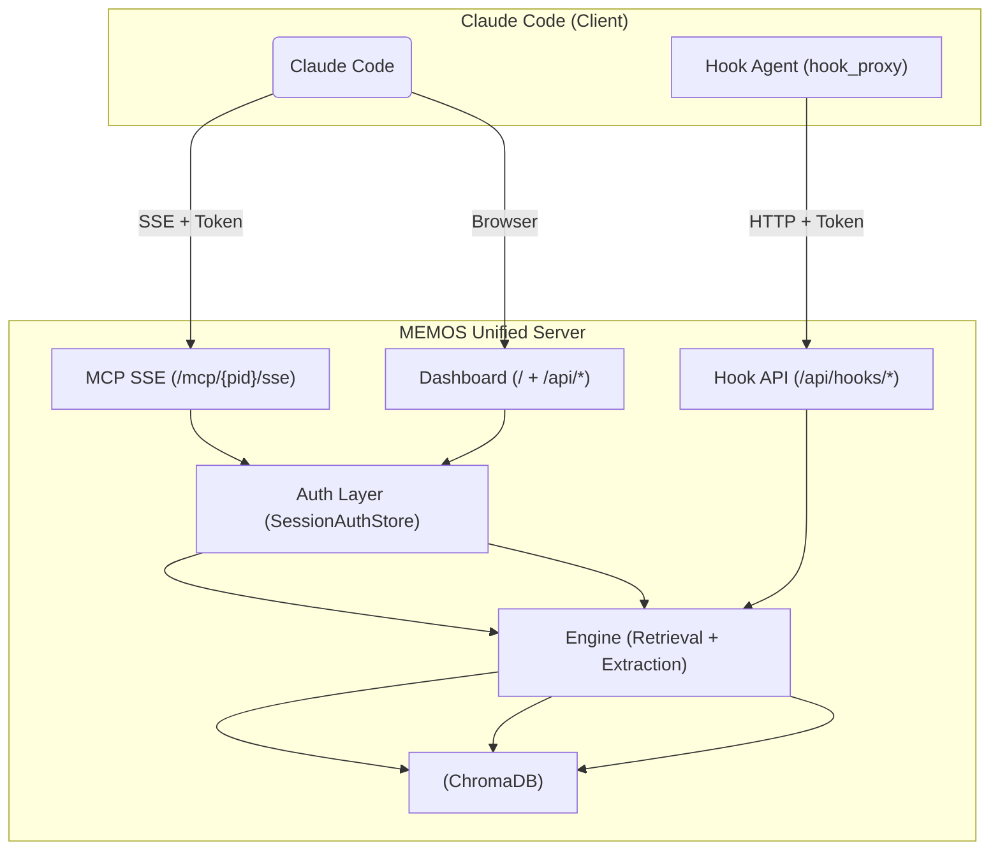

# MEMOS — Active Memory System for AI Coding Assistants

[](https://www.python.org)
[](LICENSE)
[](https://pypi.org/project/memomate/)

> 📖 [中文文档](README.zh.md)

**MEMOS** is a lightweight RAG engine designed for AI coding assistants. It provides **cross-session memory** — remembering technical decisions, bug fixes, user preferences, and code conventions from past conversations. Built on ChromaDB + bge-large-zh-v1.5, served via a unified FastAPI server with SSE-based MCP protocol.

## Features

- **🧠 Cross-Session Memory** — Captures knowledge from conversations, retrieves it across sessions
- **🔌 MCP via SSE** — 12 tools over SSE protocol, seamless integration with Claude Code
- **🔍 Hybrid Search** — Vector similarity (1024-dim) × BM25 keyword scoring, time-decay ranking
- **📊 Web Dashboard** — Browse, search, manage memories; visual configuration editor
- **🏗️ 4 Pipelines** — AI-suggested + direct-write + auto-harvest + manual curation
- **🗂️ Multi-Project + Multi-User** — Project-level and user-level data isolation
- **⚡ Lightweight Client** — `pip install memomate` (~3MB, zero ML dependencies)
- **🔐 Token Auth** — Multi-user token authentication for both MCP and Dashboard

## Prerequisites

- **Python 3.12+** — [Download](https://www.python.org/downloads/)
- **pip** — included with Python (verify: `python --version`)

Create and activate a virtual environment (recommended):

```bash
# Windows
python -m venv venv
venv\Scripts\activate

# Linux / macOS
python3 -m venv venv
source venv/bin/activate
```

## Quick Start

### 1. Install (Server)

```bash
pip install "memomate[server]"
```

### 2. Start the Unified Server

```bash
memos server
```

The first start automatically creates an admin user and prints a token. Open http://127.0.0.1:8000 for the Dashboard.

### 3. Connect Claude Code (Client)

On each developer machine that runs Claude Code, install the lightweight client and connect to the server:

> **Single-machine setup**: If you're running both server and Claude Code on one machine, just do `pip install "memomate[server]"` (includes client). No separate `pip install memomate` needed — but running `memos setup` is still required.

```bash
# Install client-only (~3MB, no ML dependencies)
pip install memomate

# One-click setup: generates config files and hooks
memos setup --server http://<SERVER>:8000 --token <TOKEN> --project <项目名>
```

| Parameter | Description | How to get |
|-----------|-------------|------------|
| `--server` | MEMOS server URL | The server machine's IP: http://192.168.1.100:8000 (use `http://127.0.0.1:8000` if same machine) |
| `--token` | Your user token | Printed by `memos server` on first start, or run `memos user token-regen <username>` on the server |
| `--project` | Project name | Any name, e.g. `MyProject`. Used for data isolation — each project has its own memory space |

**What `memos setup` generates:**

| File | Path | Purpose |
|------|------|---------|
| `.memos-project` | Project root | Project ID maping (commit to git) |
| `.mcp.json` | Project root | SSE connection config (**do not commit** — contains token; add to `.gitignore`) |
| `credentials.json` | User home | Server URL + token (one per user) |
| Hook config | `.claude/settings.json` | Auto-captures conversations to MEMOS |

After setup, **reload Claude Code** (restart the session). The MCP tools and Hook will be ready.

**Verify** it works:
- Ask "what tools do you have" — memos tools (recall, remember, etc.) should appear
- Or run `memos doctor` on the client machine to diagnose connectivity

> **Windows**: If model download stalls, set `$env:HF_ENDPOINT = "https://hf-mirror.com"` before first server start.

## Architecture



### Project Structure

```
memos/
├── src/memos/
│   ├── config/        Pydantic models, loading chain, prompts
│   ├── storage/       Vector store abstraction (ChromaDB)
│   ├── engine/        Core: memory CRUD, extraction, review, BM25
│   ├── server/        FastAPI unified app + MCP handler + SSE wrapper
│   ├── web/           FastAPI + Jinja2 dashboard (routes, auth, templates)
│   ├── cli/           argparse CLI (setup, server, user, etc.)
│   ├── features/      Backup, daily review, notifications, wizard
│   ├── hook_proxy/    SSE/stdio proxy layer (auth, project_id)
│   └── hooks/         Claude Code hook scripts (prompt/stop)
├── memdb/             ChromaDB persistent data
├── model/             Local embedding models (~1.3GB)
└── etc/               Configuration files
```

## MCP Tools (for AI Assistants)

12 tools over SSE protocol — the AI assistant calls them as if they were local:

| Tool | Pipeline | Description |
|------|----------|-------------|
| `remember(text, metadata)` | A | Buffer → LLM extraction |
| `save_knowledge(text, type)` | B | Direct write to store |
| `recall(query, top_k, ...)` | — | Semantic + hybrid search |
| `list_memories(type, limit)` | — | Paginate project memories |
| `create_todo(content, priority, due_date)` | — | Create an action item |
| `list_todos(status, limit)` | — | List pending action items |
| `update_todo(id, status)` | — | Change todo status |
| `delete_memory(memory_id)` | — | Delete by ID |
| `update_memory(id, text, meta)` | — | Update content/metadata |
| `set_project_id(pid)` | — | Switch project scope |

## CLI Commands

| Command | Description |
|---------|-------------|
| `server` | Start unified FastAPI server (MCP + Dashboard + Hook) |
| `setup` | One-click client initialization (SSE + Hook) |
| `user add/list/remove/token-regen` | Multi-user management |
| `status` | View system health |
| `doctor` | Diagnose and troubleshoot |
| `config show / set / validate` | Manage configuration |
| `export` | Export memories to JSONL |
| `import` | Import from JSONL |
| `backup / restore` | Full database backup |
| `hook install / uninstall / status` | Hook management |
| `init` | First-time setup wizard |
| `vacuum` | Reclaim deleted document space |
| `reindex` | Rebuild BM25 index |

## Configuration

All settings in `etc/config.json`. Key sections:

```json
{
  "llm": {
    "endpoints": [
      {"name": "default", "api_base": "http://localhost:11434/v1"}
    ],
    "active": "default"
  },
  "model": {"name": "bge-large-zh-v1.5", "vector_dim": 1024},
  "memory": {"decay_lambda": 0.02, "default_top_k": 5},
  "suggestion": {"active_suggestion_threshold": 0.65}
}
```

Override any field via `MEMOS_{SECTION}_{FIELD}` environment variables.

## Requirements

- Python 3.12+
- Server: ~2GB disk (bge model ~1.3GB), ML dependencies ~750MB
- Client: ~3MB, zero ML dependencies
- Windows / Linux / macOS

## License

MIT
