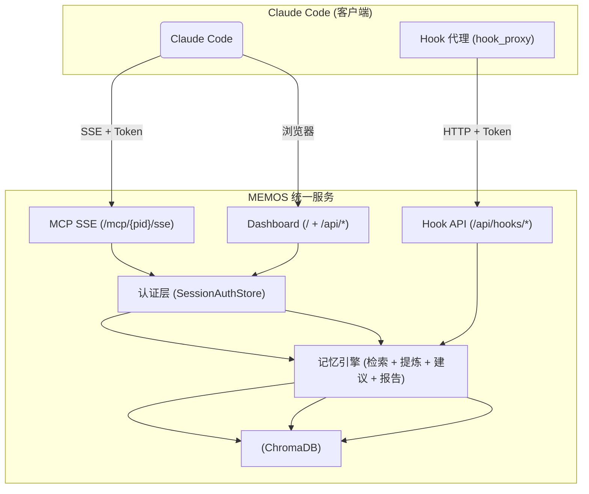

# MEMOS — AI 编程助手的记忆伙伴

[](https://www.python.org)
[](LICENSE)
[](https://pypi.org/project/memomate/)

> [English Docs](README.md)

MEMOS 是为 AI 编程助手打造的轻量级 RAG 记忆系统。采用 **统一服务架构**（FastAPI 单进程），通过 **SSE MCP 协议** 和 **Token 认证** 提供服务，支持多用户、多项目数据隔离。

## 核心特性

- **🧠 跨对话记忆** — 自动提炼对话中的知识点，跨会话持久化
- **🔌 MCP via SSE** — 12 个工具，SSE 直连，令牌认证
- **🔍 混合检索** — 向量语义（1024 维）× BM25 关键词加权 + 时间衰减排序
- **📊 Web 仪表板** — 记忆浏览、搜索、编辑、项目管理
- **🏗️ 四管线架构** — AI 写入 → 缓冲提炼 / 用户直写 / 自动采集 / 人工精炼
- **🗂️ 项目 + 用户隔离** — 双字段（creator_id + scope）数据隔离
- **⚡ 客户端轻量化** — `pip install memomate`（~3MB，零 ML 依赖）
- **🔐 多用户认证** — Token 管理，Dashboard 登录

## 前置条件

- **Python 3.12+** — [下载](https://www.python.org/downloads/)
- **pip** — Python 自带

创建并激活虚拟环境（推荐）：

```bash
# Windows
python -m venv venv
venv\Scripts\activate

# Linux / macOS
python3 -m venv venv
source venv/bin/activate
```

## 快速开始

### 1. 安装服务端

```bash
pip install "memomate[server]"
```

### 2. 启动统一服务

```bash
memos server
```

首次启动自动创建 admin 用户并打印 Token。浏览器访问 http://127.0.0.1:8000 打开 Dashboard。

### 3. 连接 Claude Code（客户端）

在每台运行 Claude Code 的开发机上，安装轻量客户端并连接到服务端：

>  **同一台机器运行服务端和客户端**：直接 `pip install "memomate[server]"` 即可（已包含客户端），不需要再 `pip install memomate`，但仍需执行 `memos setup` 生成配置。

```bash
# 安装客户端（约 3MB，无 ML 依赖）
pip install memomate

# 一键配置：生成连接配置、Hook、认证文件
memos setup --server http://<服务器地址>:8000 --token <TOKEN> --project <项目名>
```

| 参数 | 说明 | 获取方式 |
|------|------|----------|
| `--server` | MEMOS 服务端地址 | 服务器 IP，如 `http://192.168.1.100:8000`（同机用 `http://127.0.0.1:8000`） |
| `--token` | 用户令牌 | `memos server` 首次启动时打印，或服务端执行 `memos user token-regen <用户名>` |
| `--project` | 项目名称 | 任意名称，如 `MyProject`。用于项目间数据隔离 |

**`memos setup` 生成的文件：**

| 文件 | 路径 | 用途 |
|------|------|------|
| `.memos-project` | 项目根目录 | 项目 ID 映射（可提交到 Git） |
| `.mcp.json` | 项目根目录 | SSE 连接配置（**不可提交**，含 token；建议加入 `.gitignore`） |
| `credentials.json` | 用户目录 | 服务器地址 + token（每用户一份） |
| Hook 配置 | `.claude/settings.json` | 自动采集对话存入 MEMOS |

完成后**重新加载 Claude Code**（重启会话），MCP 工具和 Hook 即生效。

**验证是否成功：**
- 询问 AI "你有哪些工具" — 应看到 recall、remember 等 memos 工具
- 或在客户端执行 `memos doctor` 诊断连接状态

> **Windows 用户**：如模型下载超时，请在首次启动服务前设置镜像源：
>
> ```powershell
> $env:HF_ENDPOINT = "https://hf-mirror.com"
> ```

## 架构



### 目录结构

```
memos/
├── src/memos/
│   ├── config/        配置层（Pydantic 模型 + 加载链）
│   ├── storage/       存储抽象层（ChromaDB）
│   ├── engine/        核心引擎（CRUD + 提炼 + BM25）
│   ├── server/        FastAPI 统一服务（MCP Handler + SSE Wrapper）
│   ├── web/           Web 仪表板（FastAPI + Jinja2）
│   ├── cli/           CLI 入口（setup / server / user）
│   ├── features/      辅助功能（备份、日报、通知）
│   ├── hook_proxy/    Hook 代理层（认证 + project_id）
│   └── hooks/         Hook 脚本（prompt/stop）
├── memdb/             ChromaDB 持久化数据
├── model/             本地嵌入模型（约 1.3GB）
└── etc/               配置与持久化数据
```

## MCP 工具（供 AI 助手调用）

通过 SSE 协议提供 12 个工具：

| 工具 | 管线 | 说明 |
|------|------|------|
| `remember(text, metadata)` | A | 追加到缓冲区，满 5 轮自动提炼 |
| `save_knowledge(text, type)` | B | 用户明确指令直写知识库 |
| `recall(query, top_k, ...)` | — | 语义检索 + 混合检索 |
| `list_memories(type, limit)` | — | 分页列出记忆 |
| `create_todo(content, priority, due_date)` | — | 创建待办事项 |
| `list_todos(status, limit)` | — | 列出待办事项 |
| `update_todo(id, status)` | — | 更新待办状态 |
| `delete_memory(memory_id)` | — | 删除记忆 |
| `update_memory(id, text, meta)` | — | 更新记忆内容 |
| `force_extract()` | A | 强制立即提炼缓冲区 |
| `set_project_id(pid)` | — | 切换项目空间 |
| `log_complete_turn(user, asst)` | A | 记录完整对话轮次 |

## CLI 命令

| 命令 | 说明 |
|------|------|
| `server` | 启动统一服务（MCP + Dashboard + Hook） |
| `setup` | 一键初始化客户端（SSE + Hook） |
| `user add/list/remove/token-regen` | 多用户管理 |
| `status` | 查看系统状态 |
| `doctor` | 诊断系统健康度 |
| `config show / set / validate` | 配置管理 |
| `export` | 导出记忆为 JSONL |
| `import` | 从 JSONL 导入 |
| `backup / restore` | 全量备份与恢复 |
| `hook install / uninstall / status` | Hook 管理 |
| `init` | 首次初始化向导 |
| `vacuum` | 回收磁盘空间 |
| `reindex` | 重建 BM25 索引 |

## 配置

配置文件 `etc/config.json`，核心字段：

```json
{
  "llm": {
    "endpoints": [
      {"name": "default", "api_base": "http://localhost:11434/v1"}
    ],
    "active": "default"
  },
  "model": {"name": "bge-large-zh-v1.5", "vector_dim": 1024},
  "memory": {"decay_lambda": 0.02, "default_top_k": 5}
}
```

所有字段均可通过 `MEMOS_{节}_{字段}` 环境变量覆盖。

## 系统要求

- Python 3.12+
- 服务端：约 2GB 磁盘（嵌入模型约 1.3GB）
- 客户端：约 3MB，零 ML 依赖
- Windows / Linux / macOS

## 许可

MIT
